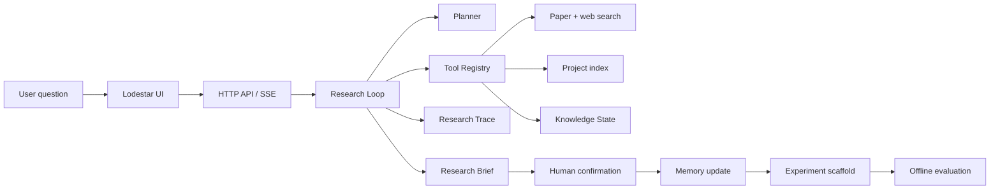

# Lodestar · Agent Research Lab

<p align="center">
  <strong>一个把 AI 前沿研究，转化为项目决策与可验证实验的 Agent 产品原型。</strong>
</p>

<p align="center">
  <a href="https://lodestar-beige.vercel.app">在线 Demo</a> ·
  <a href="https://github.com/Marina-016/lodestar">GitHub</a> ·
  <a href="#产品定位">产品定位</a> ·
  <a href="#产品思考">产品思考</a> ·
  <a href="#技术架构">技术架构</a>
</p>

<p align="center">
  
  
  
  
</p>

> Lodestar 是我为 AI 产品经理岗位准备的 Agent 项目。它探索的不是“如何让模型回答更长”，而是：**Agent 如何形成有证据的判断，理解它和当前项目的关系，在用户确认后沉淀为记忆，并把洞察推进成可验证实验。**

## 产品定位

**Lodestar 是一个项目感知、证据可追溯、记忆受治理的研究 Agent。**

它把“本周 AI 有什么新进展”转化为一条完整的产品链路：

    研究问题
       ↓
    扫描前沿信号，拆解研究任务
       ↓
    检索论文、PDF、Web，并记录工具调用
       ↓
    计算项目关联度，定位代码证据与实现缺口
       ↓
    生成 Research Brief 与 Knowledge Delta
       ↓
    用户确认记忆更新
       ↓
    生成实验假设与代码骨架

在线 Demo 默认使用 Curated Demo Replay：无需 Token、无需联网、输出稳定，适合面试展示和录制视频。
打开 [lodestar-beige.vercel.app](https://lodestar-beige.vercel.app)，直接发送预置问题即可体验。

## 产品思考

### 为什么做

我上一段实习主要做 Skill 优化。在实践中我发现：Skill 能够调用成功，并不代表 Agent 真正创造了产品价值。

一个值得长期使用的 Agent，至少要回答四个问题：

1. Agent 为什么得出这个结论？
2. 这个结论和用户正在做的项目有什么关系？
3. 哪些信息应该进入长期记忆，哪些应该被拒绝？
4. 研究结果如何继续变成可执行、可评估的动作？

Lodestar 把这四个问题变成产品约束，而不是留给模型自由发挥。

### 我定义的 Agent 产品价值

    Agent 价值
    = 有证据的判断
    + 可解释的项目关联
    + 受用户控制的状态变化
    + 可以继续执行的下一步

这也是 Lodestar 和普通 Research Chat 的区别：最终答案只是界面结果，**研究轨迹、记忆变更和实验骨架才是可以复用的产品资产**。

### 四个关键产品决策

| 产品决策 | 识别到的风险 | Lodestar 的处理 |
| --- | --- | --- |
| 默认稳定回放 | 模型、网络或 API 失败会破坏面试演示 | 线上默认 Curated Demo Replay，本地保留真实研究模式 |
| 记忆经过确认 | Agent 自动写入会污染后续上下文 | 先生成 Knowledge Delta，再由用户选择是否记住 |
| 关联度可解释 | 单一相似度分数无法支持产品决策 | 拆分技术栈、项目语境、代码证据、进行中状态 |
| 轨迹是一等产物 | 只展示最终答案，无法建立信任 | 保留来源、工具调用、代码匹配和状态变化 |

### 目标用户

需要持续跟踪 AI 进展、同时推进具体项目的产品经理、研究者和工程负责人。

典型任务包括：

- 每周扫描 Agent、Memory、Tool-use 的新进展；
- 判断一篇论文是否值得进入当前项目的验证队列；
- 复盘一次 Agent 研究过程，而不是只看最后一句答案；
- 将研究洞察变成 baseline、candidate、eval 三件套；
- 在多次对话之间保留经过确认的知识。

## Demo 里能看到什么

### 推荐演示路径

1. 输入：“本周 Agent 研究有哪些值得 Lodestar 优先验证的新进展？”
2. Agent 输出三个信号：概念、论文发现、与 Lodestar 的具体关联；
3. 查看原始论文标题和 PDF；
4. 展开项目关联度、命中的代码文件和实现缺口；
5. 确认 Knowledge State 更新；
6. 查看关联代码；
7. 生成实验骨架，进入实验项目页查看 baseline.py、candidate.py、eval.py。

### 一个 Research Brief 必须回答

    发生了什么？
    论文具体证明或观察到了什么？
    它和当前项目的关联在哪里？
    证据质量和不确定性如何？
    哪些内容值得记忆？
    下一步怎样用一个小实验验证？

## 作为 AIPM，这个项目体现了什么

### 从功能清单转向用户任务

没有从“我有 Memory、Tool Calling、SSE”开始设计，而是先定义面试官可以看懂的任务：

> 发现变化 → 判断相关性 → 查看证据 → 控制记忆 → 生成验证动作

### 给 Agent 的自主性设边界

Agent 可以自主搜索、整理和提出建议，但不能静默修改长期记忆。这是对“错误记忆会如何影响后续任务”的风险判断。

### 把关联度做成可讨论的决策依据

项目关联不是一句“这很相关”，而是拆成技术栈命中、项目语境命中、代码证据和进行中状态。这样产品经理可以继续追问：哪个维度贡献最高？怎样调整权重？怎样设计评估集？

### 把研究结果推进到下一步

每个重要判断都必须继续回答：

> 应该更新什么知识？
> 应该验证哪个假设？
> baseline 和 candidate 如何比较？
> 成功标准是什么？

### 对 Demo 稳定性负责

作品集 Demo 的目标不是证明“模型偶尔能回答”，而是让面试官稳定看见完整产品链路。因此线上默认回放、本地保留真实模式，是对可靠性和真实能力之间的主动取舍。

## Why Lodestar?

Most research assistants stop at a polished answer. Lodestar is designed around the steps that make an answer useful in a real product:

1. identify what changed in the field;
2. explain the concept instead of only listing a paper;
3. connect the signal to the active project's code and implementation gap;
4. preserve sources and tool decisions as an auditable trace;
5. ask the user before changing long-term memory;
6. turn a confirmed insight into an executable experiment scaffold.

This makes Lodestar a compact demonstration of agent memory, tool calling, human-in-the-loop control, project-grounded retrieval, evaluation, and the research-to-build loop.

## The demo in one minute

The default portfolio mode is a deterministic **Curated Demo Replay**. It does not require an API token, network access, or a live model, so an interviewer can repeat the same flow without watching a loading spinner fail:

```text
Weekly frontier scan
        |
User selects a research direction
        |
Paper and PDF evidence plus project-code relevance
        |
Auditable Research Trace
        |
User confirms a Knowledge State update
        |
Confirmed insight -> Experiment scaffold
```

The local UI is available at `http://127.0.0.1:8123`. A deployed replay is also supported through the Vercel adapter in [`api/index.py`](api/index.py).

## What the current build demonstrates

| Capability | What to look for in the product | Implementation surface |
| --- | --- | --- |
| Frontier research | Three signals with concept, paper finding, Lodestar relation, and PDF links | `lodestar/frontier.py`, `lodestar/demo.py` |
| Tool calling | Search, read, project-context, knowledge, and registry tools | `lodestar/tools/`, `lodestar/mcp_server.py` |
| Research Trace | Ordered events for planning, retrieval, evidence assessment, and synthesis | `lodestar/trace/`, `research_tasks.trace_events` |
| Project relevance | Explainable relevance score plus matching repository files | `lodestar/relevance.py`, `lodestar/project_index.py` |
| Memory lifecycle | Pending proposal -> user confirmation -> Knowledge State update | `lodestar/memory/repo.py`, `/api/conversation/:id/remember` |
| Evaluation | Offline golden cases for coverage, faithfulness, sources, and task success | `tests/`, `lodestar/eval/` |
| Experiment loop | Research opportunity -> baseline/candidate scaffold -> `eval.py` | `lodestar/experiment.py`, `workspace/experiments/` |
| Stable presentation | Curated replay, paced streaming, fixed demo dataset, no token required | `lodestar/demo.py`, `api/index.py` |

## How it works

### 1. Research state, not just chat history

Every run has a task record, sources, trace events, Knowledge State proposals, and optional experiment artifacts. The conversation is the surface; the state underneath is the product.

### 2. Memory is a governed write path

Research can propose a memory update, but it cannot silently rewrite the user's long-term context. The UI exposes the proposal, the user chooses what to retain, and the repository records the applied update. This is the product boundary between **retrieval** and **memory**.

### 3. Project relevance is explainable

A weekly signal receives an explainable score built from technology-stack overlap, project context, code evidence, and active status. The result is not "this feels relevant"; it is a concrete path from:

```text
paper signal -> project evidence -> implementation gap -> experiment hypothesis
```

### 4. Trace is a first-class artifact

The agent records the path it took, not only the final markdown. That makes it possible to answer: which source was used, which tool was called, which code files were matched, why a memory update was proposed, and what should be evaluated next.

## Architecture



The system has two execution paths:

- **Curated replay**: fixed, source-backed demo data for a reliable portfolio presentation.
- **Research loop**: planner -> tools -> reranker -> assessor -> synthesizer, with live or mock providers selected by configuration.

The UI keeps both paths behind the same task and evidence model, so the demo communicates the real architecture without requiring a live provider at every step.

## Quickstart

### Requirements

- Python 3.10+
- Windows, macOS, or Linux
- No token required for the offline demo

### Install

```bash
python -m venv .venv
# macOS/Linux
source .venv/bin/activate
# Windows PowerShell
.\\.venv\\Scripts\\Activate.ps1

python -m pip install -r requirements.txt
```

### Run the deterministic demo

```powershell
$env:LODESTAR_DEMO_REPLAY="true"
python -m lodestar demo reset
python -m lodestar ui --port 8123 --no-browser
```

Open <http://127.0.0.1:8123> and send the pre-filled frontier question. The demo is intentionally repeatable and does not consume model tokens.

### Verify the environment

```powershell
Invoke-RestMethod http://127.0.0.1:8123/api/demo/readiness | ConvertTo-Json -Depth 6
```

```bash
python -m unittest tests.test_smoke -v
python scripts/preflight_public_release.py
```

The public-release preflight is dependency-free. It scans the release set for common token formats, private keys, oversized files, and accidentally tracked runtime artifacts.

## Live research mode

The replay is the recommended first run. To connect a compatible Anthropic endpoint for real research, copy the safe template and configure credentials locally:

```powershell
Copy-Item .env.example .env
```

Then set the required provider variables in `.env` or your shell. `.env` is ignored and must never be committed. Live mode also benefits from a persistent database and workspace directory; the Vercel deployment intentionally stays in replay mode.

## Deployment

### Vercel: portfolio replay

The repository includes a Vercel Python entrypoint and routing file:

- [`api/index.py`](api/index.py) adapts the existing HTTP handler;
- [`vercel.json`](vercel.json) routes the UI and API through that function;
- [`.vercelignore`](.vercelignore) keeps local databases, experiments, and caches out of the deployment.

Deploy with the Vercel CLI:

```bash
npm install -g vercel
vercel login
vercel link
vercel --prod
```

The adapter sets `LODESTAR_DEMO_REPLAY=true`, uses `/tmp` for ephemeral state, and completes replay tasks synchronously so serverless freezing cannot interrupt the demo. This is a deliberate product decision: **Vercel is the stable showcase surface; local mode is the development and live-research surface.**

### Local production-like check

```bash
python -m py_compile lodestar/ui.py api/index.py
python scripts/preflight_public_release.py
```

## Repository map

```text
Lodestar/
|-- api/index.py              # Vercel serverless entrypoint (demo replay)
|-- docs/                     # design notes, demo script, recording runbook
|-- lodestar/
|   |-- agent/                # planner, retrieval loop, assessor, synthesizer
|   |-- build/                # coding-agent executors and scaffold execution
|   |-- eval/                 # golden cases, metrics, evaluation harness
|   |-- harness/              # Codex conversation harness integration
|   |-- memory/               # SQLite schema and Knowledge State repository
|   |-- tools/                # paper, web, project, knowledge, registry tools
|   |-- trace/                # ordered Research Trace recorder
|   |-- demo.py               # curated dataset and deterministic replay
|   |-- experiment.py         # opportunity extraction and experiment scaffolds
|   |-- project_index.py      # local/GitHub project indexing
|   |-- relevance.py          # explainable project relevance scoring
|   `-- ui.py                 # zero-build local UI, HTTP API, and SSE stream
|-- scripts/
|   `-- preflight_public_release.py
|-- tests/                    # offline smoke, lifecycle, harness, and project tests
|-- .env.example              # safe configuration template; no credentials
|-- vercel.json               # Vercel routing/build configuration
|-- pyproject.toml            # package metadata and CLI entrypoint
`-- requirements.txt          # runtime dependencies
```

Runtime directories are intentionally ignored:

- `lodestar/data/` - local SQLite database;
- `workspace/` - briefs, traces, source snapshots, and experiment output;
- `experiments/` - generated experiment projects;
- `.env` - local credentials and provider configuration.

## Useful commands

```bash
python -m lodestar research "<goal>" --mock --offline --yes
python -m lodestar eval --mock --offline

python -m lodestar knowledge list
python -m lodestar knowledge search memory
python -m lodestar knowledge diff <task_id>

python -m lodestar experiment list
python -m lodestar experiment save <task_id>
python -m lodestar experiment build <exp_id> --scaffold-only

python -m lodestar project add https://github.com/owner/repo --status active
python -m lodestar project list
python -m lodestar project index <id> --path <local-repo>
```

## Demo recording flow

The recommended portfolio story is intentionally short:

1. Ask: "What new agent research should Lodestar prioritize this week?"
2. Show three signals: concept, paper finding, project relation, and PDF source.
3. Choose the trusted-memory signal and ask why relevant memories can still hurt reasoning.
4. Expand the project evidence and show matched files plus the relevance score.
5. Confirm the memory update to write the Knowledge State.
6. Continue to the related code, then generate an experiment scaffold.
7. Open the experiment project and show `baseline.py`, `candidate.py`, and `eval.py`.

The full recording script is in [`docs/demo-recording-v2.md`](docs/demo-recording-v2.md).

## Evaluation and engineering trade-offs

Lodestar ships with offline golden cases so the core workflow can be tested without a provider or network. The suite checks source uniqueness, evidence coverage, venue metadata, faithfulness, task success, Knowledge State behavior, project relevance, and experiment scaffolding.

The current implementation intentionally favors:

- deterministic replay over a fragile live demo;
- explicit user consent over silent memory writes;
- explainable relevance over a single opaque similarity score;
- small composable tools over one giant research function;
- artifacts and traces over a final answer that cannot be inspected.

## Security and public-repository policy

Before publishing, run `python scripts/preflight_public_release.py` and inspect `git diff --cached`.

Never commit:

- `.env`, API keys, access tokens, cookies, or private keys;
- SQLite databases and generated traces;
- PDF caches, screenshots, recordings, or local experiment outputs;
- local proxy URLs, account identifiers, or machine-specific paths.

The repository is safe to run publicly in replay mode. Live provider credentials belong in Vercel environment variables or a local `.env`, never in source code.

## Roadmap

- [x] Evidence-backed weekly frontier scan
- [x] Project-code relevance mapping with explainable score
- [x] Research Trace and SSE streaming
- [x] Human-confirmed Knowledge State updates
- [x] Offline evaluation and experiment scaffold loop
- [x] Stable Vercel demo adapter
- [ ] Persistent hosted memory with a managed database
- [ ] Source-level claim verification and citation diffing
- [ ] Evaluation dashboard for memory traps, tool-use recovery, and token cost
- [ ] Multi-project workspace and permissioned memory scopes

## License

Apache-2.0. See [`LICENSE`](LICENSE).

## Acknowledgements

Lodestar is a learning-oriented implementation built to make agent product decisions inspectable: what the system remembers, which tools it calls, how it uses evidence, and how a research idea becomes a measurable build task.
