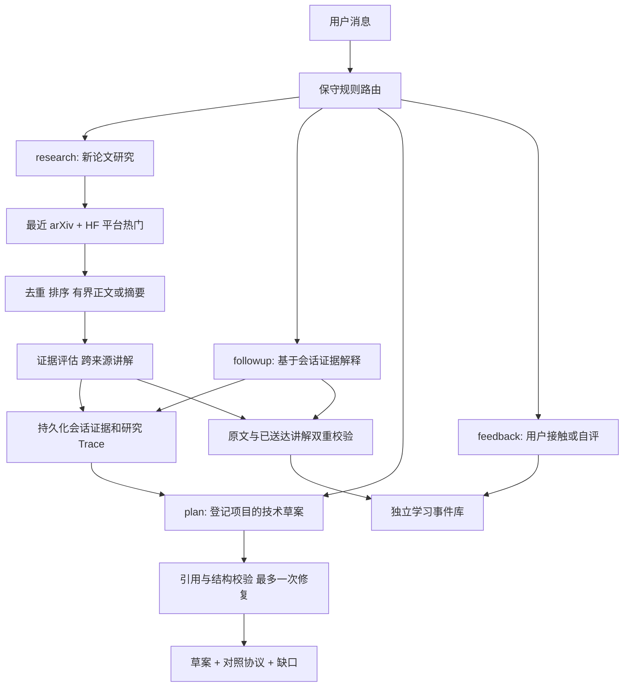

# Agent 后端 MVP 的实际逻辑

2026-10-09：普通对话已改为模型选择只读动作的有界循环，灵活组织回答；
下文的固定追问补读和四节展示描述为此前版本。最新实现与验证边界见
[对话 harness 调整](dialogue-harness.md)。研究和显式方案路径继续沿用原流程。

当前只实现本地 CLI/服务层，界面未改。主编排是确定性代码，LLM 生成内容；工具错误、来源证据和状态变化保存到 Trace。

| 阶段 | 实际调用 | 边界与产物 |
|---|---|---|
| 路由 | agent/routing.py 规则 | 默认 auto；用户可指定 intent。复杂意图可能需要澄清 |
| 研究规划 | planner/queries 的 LLM 内容调用 | 查询、研究问题与工具政策保存 Trace |
| 新发布发现 | discover_papers recent → arXiv API | UTC 滚动窗口 1–30 天，默认 7 天；有查询和返回条数限制 |
| 热门发现 | discover_papers trending → HF daily_papers API | 仅 HF 平台关注信号；旧论文也可热门，不代表全网最热 |
| 阅读 | read_paper；非论文分支 read_webpage | PDF 有界正文片段、覆盖标签、字符跨度；失败不伪装成功，摘要降级明确标记；合格来源存在时优先兼顾新发布和热门各一篇 |
| 讲解 | assess/synthesis/novelty | 引用来源，区分已读范围；研究知识笔记更新可待确认，不代表用户掌握 |
| 追问 | ConversationAgent + conversation LLM | 重启后复用持久化证据；细节问题最多补读两篇已保存论文 |
| 个人学习记忆 | read_learning_profile / record_learning_evidence；内部 learning 仓储 | technology + method + paper URL + 证据。解释/讨论/自评不升掌握，示范类证据由调用方核验 |
| 项目证据 | project CLI 登记/index + repo 搜索 | 本地有界代码/文档索引；本轮远端验收只获准三个文件片段 |
| 方案 | technical_plan LLM + plan_contract | 问题/论文方法/候选改动/对照协议/风险/缺口。校验原文与已提供路径，最多一次修复，始终 draft |
| 演示 | agent-demo | 新目录、独立数据库，或明确回放历史录制；不调用模型、不联网、不改真实用户库 |

两种记忆分开维护：研究知识库存论文与研究笔记；学习事件库存用户与技术/方法的关系和表现。后者由完整有效事件历史计算掌握、论文接触数量，展示近期证据有界，但不会因为近期讨论很多而丢掉旧的掌握依据。撤销证据后重新计算；概念定义、组成和适用场景不作为个人学习事实写入。

模型配置只在本地，密钥不进源码和报告。本次免费验收明确使用 qwen3.8-flash，服务端用完即停已经确认，不回退模型。本地调用总开关默认关闭，验收进程显式启用。开关本身不检测免费额度，换账号/模型前需重新核对额度和服务端保护。

本期的方案交付是可追踪、可审阅的实验草案；不自动实施代码或证明收益。项目订阅及到期检索、候选评估到方案、独立输出评分 A/B 已实现；真实论文方法的受限诊断已运行，代表性项目收益验证、自动掌握评估、技术别名/语义召回和 UI 仍待完成。当前用户范围隔离用于本地数据管理，不是联网服务认证。

综合失败时返回 error 并保存 read_evidence.json，后续会话可复用证据恢复。讲解中的明显全域推断会标记待核对；这是窄范围文字检查，不是自动事实审查。用户明确的技术主题会优先组织论文方法关系，避免以论文系统名替代技术。

2026-10-08 增加独立 watch 订阅与轮询器：公开查询、到期执行、按项目保存去重候选和命中片段，零模型调用。它是词法候选发现，不是语义适用性结论，未启用永久服务；见 [主动论文发现](proactive-paper-discovery.md)。

2026-10-08：候选方案绑定 assessment/read 与项目证据快照，变更后要求重评。实验显式执行并保存两组实现和实际输出，草案与实验结果分开。当前完整范围与验收缺口见 [Agent PRD](agent-prd.md)，实验协议见 [成对实验](paired-experiments.md)。

方案后的动作现在明确分支：propose_change 产生待审阅的实现草案与显式成对实验入口；investigate 产生调查问题，可登记已复核的诊断记录；no_change 保留有据理由，停止改动路径。调查记录位于 paper_candidate_investigations，带同项目/论文/评估/阅读/方案关联，研究结果不触发个人掌握或自动采用。

2026-10-08 追问讲解现在使用 conversation_grounded：论文陈述必须附指定来源的原文引用；只恢复 PDF 空白换行，不替换词语、标点或省略号。未匹配陈述不交付，原始模型草案和错误保留。每条通过的陈述附出处链接，推测、缺口及一般知识说明单独显示；字面校验不证明语义支持。一般知识仍由 LLM 组织，不写入个人学习记忆；方法接触只从通过校验的论文陈述提取，排除一般知识、推测、缺口。
