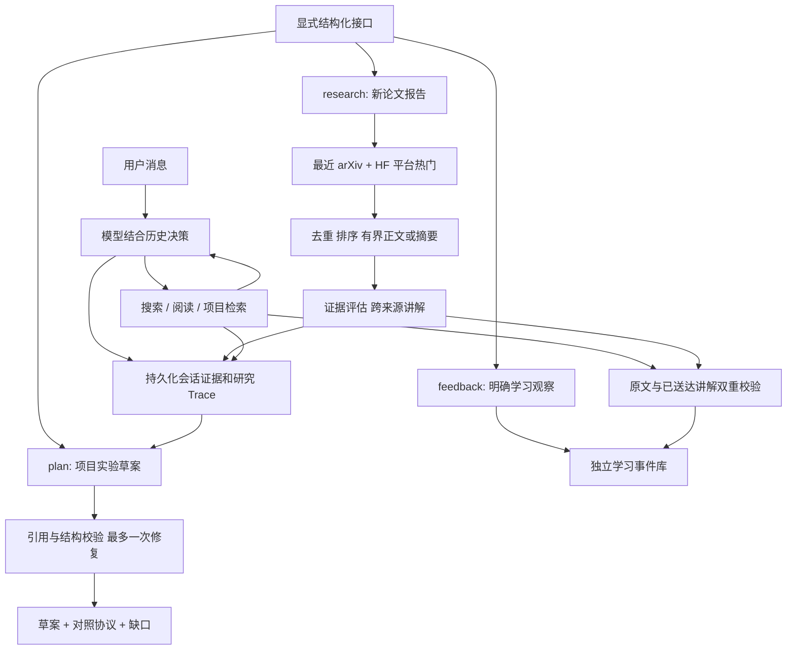

# Agent 当前架构与单入口演进边界

2026-10-10：普通对话为连续原生工具循环，提供文字流式、模型/档位/思考设置；不再经过独立 JSON 动作规划或 explanation.py 回答阶段。实现与质量限制见 [对话 harness](dialogue-harness.md)。研究和显式方案路径继续沿用原流程。

新产品定义见 [PRD](agent-prd.md)：默认单入口、用户显式分离任务、可管理记忆。它们是下一阶段规划，下面“当前架构”不表示这些能力已实现。

当前只实现本地 CLI/服务层，界面未改。普通对话由模型选择只读动作，宿主执行并保存证据；显式研究、方案和反馈继续使用结构化流程。

| 阶段 | 实际调用 | 边界与产物 |
|---|---|---|
| 普通对话 | agent/dialogue.py 模型决策循环 | 默认 auto；不经过关键词路由。显式 intent 保留结构化接口 |
| 研究规划 | planner/queries 的 LLM 内容调用 | 查询、研究问题与工具政策保存 Trace |
| 新发布发现 | discover_papers recent → arXiv API | UTC 滚动窗口 1–30 天，默认 7 天；有查询和返回条数限制 |
| 热门发现 | discover_papers trending → HF daily_papers API | 仅 HF 平台关注信号；旧论文也可热门，不代表全网最热 |
| 阅读 | read_paper；非论文分支 read_webpage | PDF 有界正文片段、覆盖标签、字符跨度；失败不伪装成功，摘要降级明确标记；合格来源存在时优先兼顾新发布和热门各一篇 |
| 讲解 | assess/synthesis/novelty | 引用来源，区分已读范围；研究知识笔记更新可待确认，不代表用户掌握 |
| 普通对话/追问 | ConversationAgent + dialogue.gather + providers/dialogue | 原生工具消息往返，模型决定搜索/读取/核验；共享默认 8 次操作与预留回答；复用持久化会话证据 |
| 流式与设置 | scripts/chat + chat_settings + providers/reasoning | 进程内切换同服务模型/档位/思考，保留会话；不改 .env，不静默降级，未接入旧 Web UI |
| 个人学习记忆 | read_learning_profile / record_learning_evidence；内部 learning 仓储 | technology + method + paper URL + 证据。解释/讨论/自评不升掌握，示范类证据由调用方核验 |
| 项目证据 | project CLI 登记/index + repo 搜索 | 本地有界代码/文档索引；本轮远端验收只获准三个文件片段 |
| 方案 | technical_plan LLM + plan_contract | 问题/论文方法/候选改动/对照协议/风险/缺口。校验原文与已提供路径，最多一次修复，始终 draft |
| 演示 | agent-demo | 新目录、独立数据库，或明确回放历史录制；不调用模型、不联网、不改真实用户库 |

两种记忆分开维护：研究知识库存论文与研究笔记；学习事件库存用户与技术/方法的关系和表现。后者由完整有效事件历史计算掌握、论文接触数量，展示近期证据有界，但不会因为近期讨论很多而丢掉旧的掌握依据。撤销证据后重新计算；概念定义、组成和适用场景不作为个人学习事实写入。

模型配置只在本地，密钥不进源码和报告。10-08 的免费验收条件仅是历史记录；10-10 已支持并验证同服务模型切换和显式思考通路，不代表质量提升或免费。代码 model_calls_disabled 默认 false，.env.example 显式 true，实际看加载配置；开关不检测免费额度，换账号/模型仍需核对费用授权，不自动付费回退。

本期的方案交付是可追踪、可审阅的实验草案；不自动实施代码或证明收益。项目订阅及到期检索、候选评估到方案、独立输出评分 A/B 已实现；真实论文方法的受限诊断已运行，代表性项目收益验证、自动掌握评估、技术别名/语义召回和 UI 仍待完成。当前用户范围隔离用于本地数据管理，不是联网服务认证。

综合失败时返回 error 并保存 read_evidence.json，后续会话可复用证据恢复。讲解中的明显全域推断会标记待核对；这是窄范围文字检查，不是自动事实审查。用户明确的技术主题会优先组织论文方法关系，避免以论文系统名替代技术。

2026-10-08 增加独立 watch 订阅与轮询器：公开查询、到期执行、按项目保存去重候选和命中片段，零模型调用。它是词法候选发现，不是语义适用性结论，未启用永久服务；见 [主动论文发现](proactive-paper-discovery.md)。

2026-10-08：候选方案绑定 assessment/read 与项目证据快照，变更后要求重评。实验显式执行并保存两组实现和实际输出，草案与实验结果分开。当前完整范围与验收缺口见 [Agent PRD](agent-prd.md)，实验协议见 [成对实验](paired-experiments.md)。

方案后的动作现在明确分支：propose_change 产生待审阅的实现草案与显式成对实验入口；investigate 产生调查问题，可登记已复核的诊断记录；no_change 保留有据理由，停止改动路径。调查记录位于 paper_candidate_investigations，带同项目/论文/评估/阅读/方案关联，研究结果不触发个人掌握或自动采用。

历史实现（2026-10-08，已替换）：conversation_grounded 曾将讲解按原文引文、推测和缺口分栏。不再把这套展示门禁当作当前普通回答的逐句事实核验。现为自然 Markdown 回答；独立学习接触仍要求来源与已送达讲解双重引用，显式方案仍有契约。绿色测试或文字范围标注不证明回答事实性。

2026-10-09 检索层改为共享 arXiv 客户端；模型可用 discover_papers 和明确 days 日期条件。
候选元数据与已读正文隔离并支持跨轮追问，详见 [论文检索可靠性](retrieval-reliability.md)。

## 单入口演进（规划，非当前实现）

保留 ConversationAgent / 原生工具循环；增加主空间/工作项、单次运行快照和范围过滤的记忆/历史仓储，Web UI 消费同一服务的事件流，不接回旧演示研究路径。

现有 conversations/messages 是持久化消息容器；agent_sessions 绑定 user/project/evidence；research_tasks 是一次研究执行。新 work_item 是长期任务，两者不能仅改名等同。当前用户学习事件可跨会话词法召回，但尚无 task 范围；旧 concepts/projects 等数据也需补归属，不能假定已有完整隔离。

先按 owner、task/project 和外发许可过滤，再检索/组装近期消息、有效记忆、证据和可追溯摘要。独立任务只从本范围读取；全局记忆须已授权；分离只带用户选定快照。停用/纠正/删除同时使相关摘要和索引失效，不能只修改 UI 列表。

运行固定任务、输入、配置和版本快照，首版同任务串行/幂等，不同任务独立排队。新前端切换任务或模型不能改在途运行归属。不新增强制路由/反思 Agent，也不以向量库作为首版依赖。详细数据建议、迁移、恢复、费用与验收见 PRD 第 4–9 节。
